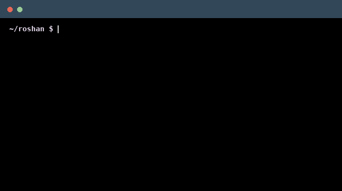

<!--
    Hey there, I'm Roshan Pathak!
    Good to see you 👋
-->

  

<!--
    My terminal-style introduction
-->

    

 

<!--
    Main technologies
-->

### 🛠️ Main Skills

### ☁️ Currently Exploring

 

<!--
    Projects
-->

<!--
     Featured Projects
-->

### 🚀 Featured Projects

<table>
<tr>
<td width="50%" valign="top">

<h3>🛒 E-Commerce Backend</h3>

Spring Boot backend for an e-commerce application with RESTful APIs, authentication, product management and order workflows.

</td>

<td width="50%" valign="top">

<h3>🏥 Hospital Management System</h3>

Backend application for managing patients, doctors and hospital workflows using a structured Spring Boot architecture.

</td>
</tr>

<tr>
<td width="50%" valign="top">

<h3>🌍 Tourist Management System</h3>

RESTful Spring Boot application for managing tourist destinations and bookings with persistent database storage.

</td>

<td width="50%" valign="top">

<h3>🔬 Smart AI Research Assistant</h3>

Spring Boot application exploring AI-powered capabilities through backend APIs and intelligent research workflows.

</td>
</tr>
</table>

<!--
    GitHub Statistics
-->

### 📊 GitHub

 

<!--
    Connect with me
-->

### 🤝 Connect with me

    
</a>
    </a>

 

<!--
    Recruiters
-->

### 💼 Employer?

> [!IMPORTANT]
> I'm currently open to **Software Engineering / Java Backend opportunities**.
>
> 📄 **[Download my Resume](https://drive.google.com/file/d/1ohFW9gn1WCnC3mwfTLambscSgxOkEHdc/view?usp=drive_link)**

<!--
    Thanks for visiting! ❤️
-->
